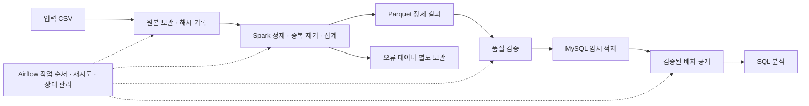

# GitBugs Data Pipeline

**흩어진 이슈 중복 관계를 분석 가능한 데이터로 정리하는 배치 파이프라인**

`Python` · `Apache Airflow` · `Apache Spark` · `MySQL` · `Parquet` · `Docker Compose`

GitBugs CSV에 기록된 이슈 간 중복 관계를 읽어, 잘못된 값을 검증하고 중복을 제거한 뒤 MySQL에 저장합니다. 최종 데이터로 **어떤 이슈가 서로 연결되어 있는지, 연결이 많은 이슈는 무엇인지** SQL로 조회할 수 있습니다.

데이터 정제부터 작업 자동화, 분석 테이블 설계, 실패 후 복구까지 구현한 **데이터 엔지니어링 포트폴리오 프로젝트**입니다. 사용자는 Airflow 화면에서 작업을 실행·관찰하고, SQL로 결과를 확인합니다.

> **구현 및 로컬 검증 완료** — 저장소의 2026-09-06 검증 기록 기준, 컨테이너 테스트 25개 통과 · Airflow 작업 8개 성공 · 최종 관계 1,034건. [검증 기록 보기](docs/validation.md)

## GitBugs 데이터셋은 무엇인가요?

**이슈(issue)**는 소프트웨어의 오류나 개선 요청을 기록한 보고서입니다. 서로 다른 사람이 같은 문제를 신고하면 여러 이슈가 동일한 버그를 가리킬 수 있으며, 이때 이슈 사이에 중복 관계가 생깁니다.

GitBugs는 오픈소스 프로젝트의 버그 보고서를 다루는 데이터셋으로, 중복 보고서 탐지, 관련 보고서 검색, 이슈 분류 등의 연구에 활용할 수 있도록 소개되어 있습니다. 배포 페이지에는 CC BY 4.0 라이선스와 인용 정보가 명시되어 있습니다. 출처: [GitBugs 데이터셋 카드](https://huggingface.co/datasets/av9ash/GitBugs).

### 이 프로젝트에서 사용하는 데이터

이 저장소에서는 GitBugs의 **이슈 간 중복 관계를 담은 2개 컬럼의 CSV**를 분석합니다. 데이터셋 카드에서 설명하는 제목·본문·상태 등의 전체 버그 보고서 필드와 이 프로젝트의 입력 범위는 구분해야 합니다.

| 항목 | 내용 |
| --- | --- |
| 입력 파일 | [`gitbugs_full_data.csv`](gitbugs_full_data.csv) |
| 크기 | 1,021행 · 2개 컬럼 · 19,674 bytes |
| `Issue id` | 관계를 기록하는 기준 이슈의 식별자 |
| `Duplicate id` | 중복 관계로 연결된 이슈 ID. 한 셀에 쉼표로 구분된 여러 ID가 들어갈 수 있음 |
| 여러 ID가 담긴 행 | 21행 |
| 분석 단위 | 개별 이슈와 이슈 사이의 연결 관계 |

[`data.ipynb`](data.ipynb)에는 `av9ash/GitBugs`를 불러온 뒤 제공된 split들을 합쳐 CSV로 저장하는 코드와 1,021행 저장 기록이 있습니다. 다만 다운로드 당시 데이터셋 revision과 split별 원본 목록은 별도로 보존되어 있지 않습니다.

이 프로그램은 **이미 기록된 중복 관계를 정리하고 그 구조를 분석**합니다. 텍스트를 읽어 새로운 중복 이슈를 예측하는 모델은 구현하지 않았습니다. 또한 `Issue id`와 `Duplicate id`만으로 어느 쪽이 대표 보고서인지, 해당 버그가 얼마나 심각한지는 알 수 없습니다.

## 어떤 문제를 해결하나요?

원본 CSV는 `Issue id`와 `Duplicate id` 두 컬럼으로 구성됩니다. 하나의 셀에 여러 ID가 들어 있거나 같은 ID가 반복되면, 행을 그대로 세는 것만으로는 실제 관계 수를 알기 어렵습니다. 작업을 다시 실행할 때 이미 저장한 관계가 중복으로 쌓이는 문제도 고려해야 합니다.

이 프로젝트는 다음 세 가지에 집중합니다.

| 문제 | 구현한 해결 방법 |
| --- | --- |
| 한 셀의 여러 ID와 반복된 관계 때문에 집계가 부정확해짐 | Spark로 ID 목록을 분리하고 관계 단위로 중복 제거 |
| 잘못된 데이터가 분석 결과에 섞일 수 있음 | ID·자기 참조·처리 건수를 검증하고 오류 데이터를 별도 보관 |
| 재실행이나 적재 중 실패로 결과가 달라질 수 있음 | 입력 버전 식별, 임시 적재, 트랜잭션을 통한 결과 공개 |

### 데이터가 바뀌는 모습

아래는 처리 규칙을 설명하기 위한 간단한 예시입니다.

**입력 CSV**

```csv
Issue id,Duplicate id
100,"200, 300, 200"
200,100
```

**정제된 관계 테이블**

| issue_id | duplicate_id |
| ---: | ---: |
| 100 | 200 |
| 100 | 300 |
| 200 | 100 |

`100 → 200`의 반복은 제거하고, `100 → 200`과 `200 → 100`은 방향이 다르므로 각각 보존합니다. 방향을 무시하고 연결된 쌍을 셀 때는 두 관계를 하나로 계산합니다. 따라서 이 예시의 방향 관계는 **3건**, 무방향 관계는 **2건**입니다.

## 데이터 분석 결과

저장소의 [`gitbugs_full_data.csv`](gitbugs_full_data.csv)를 처리한 결과입니다.

```text
원본 1,021행
  → 한 셀의 ID 목록을 분리하여 1,042개 관계 생성
  → 동일 방향의 중복 관계 8개 제거 / 오류 관계 0개
  → 최종 1,034개 관계 저장
```

| 분석 지표 | 결과 | 의미 |
| --- | ---: | --- |
| 전체 고유 이슈 | 1,068개 | 관계 양쪽에 등장하는 ID의 합집합 |
| 방향 관계 | 1,034개 | `A → B`와 `B → A`를 구분한 관계 수 |
| 무방향 관계 | 560개 | 방향을 무시한 고유 연결 쌍 |
| 상호 참조 쌍 | 474개 | 양쪽 방향이 모두 존재하는 쌍 |
| 상호 참조 비율 | 84.64% | 전체 무방향 쌍 중 상호 참조 쌍의 비율 |

### 1. 관계의 84.64%는 양쪽 방향으로 기록되어 있습니다

고유한 연결 쌍 560개 중 **474개는 `A → B`와 `B → A`가 모두 존재**하고, 나머지 **86개(15.36%)는 한 방향만 존재**합니다.

따라서 방향 관계 1,034건을 서로 다른 버그 쌍의 수로 해석하면 연결 수를 과대 계산하게 됩니다. 연결된 쌍 자체를 분석할 때는 무방향 관계 560개를, 누가 누구를 참조하는지 분석할 때는 방향 관계 1,034개를 사용해야 합니다. 이 비율은 기록 방식에 대한 통계이며 중복 탐지 모델의 정확도를 뜻하지 않습니다.

### 2. 이슈의 95.22%는 하나의 다른 이슈와 연결되어 있습니다

| 연결된 고유 이웃 수 | 이슈 수 | 전체 1,068개 이슈 중 비율 |
| ---: | ---: | ---: |
| 1개 | 1,017개 | 95.22% |
| 2개 | 50개 | 4.68% |
| 3개 | 1개 | 0.09% |

이슈당 평균 고유 이웃 수는 **약 1.05개**입니다. 현재 데이터에서는 직접 연결이 많은 이슈보다 하나의 이웃만 가진 이슈가 대부분입니다. 비율은 반올림으로 합계가 100%와 다를 수 있습니다.

여기서 이웃 수는 **직접 연결된 이슈 수**입니다. 이웃이 1개인 이슈도 더 큰 연결 그룹의 끝에 속할 수 있으므로, 이 결과만으로 대부분의 버그 그룹이 두 이슈로 구성된다고 단정할 수는 없습니다.

### 3. 연결이 가장 많은 이슈는 `13363492`입니다

아래는 고유 이웃 수 내림차순, 같은 경우 이슈 ID 오름차순으로 정렬한 상위 5개입니다.

| 이슈 ID | 들어오는 관계 수 | 나가는 관계 수 | 고유 이웃 수 |
| ---: | ---: | ---: | ---: |
| 13363492 | 1 | 2 | 3 |
| 13290844 | 1 | 2 | 2 |
| 13315797 | 1 | 1 | 2 |
| 13327984 | 1 | 1 | 2 |
| 13339673 | 1 | 1 | 2 |

`13363492`는 `13363490`, `13363491`, `13363493`과 연결되어 있습니다. 여러 보고서 사이의 관계를 수동으로 검토할 때 먼저 살펴볼 후보로 활용할 수 있습니다. 다만 연결 수가 많다는 사실이 버그의 심각도나 수정 우선순위가 높다는 의미는 아닙니다.

### 4. 원본 행 수만으로는 실제 관계 수를 알 수 없습니다

원본 1,021행 중 여러 ID를 담은 21행을 분리하면 1,042개 관계가 됩니다. 여기에 반복된 방향 관계 8개를 제거하면 **최종 1,034개 관계**가 남습니다. 이 결과는 CSV 행 수 집계 전에 목록 분리와 관계 단위 중복 제거가 필요하다는 점을 보여줍니다.

현재 입력에서 잘못된 ID나 자기 참조로 격리된 관계는 0개였습니다. 이는 구현된 형식·관계 검증을 통과했다는 뜻이며, 원본의 모든 중복 관계가 의미적으로 정확함을 보증하는 수치는 아닙니다.

수치는 [독립 Python 프로파일](docs/source-profile.json), [Spark 품질 보고서](docs/spark-quality.json), [SQL 조회 결과](docs/analysis-results.txt)에서 확인할 수 있습니다.

## 시스템 구조



여기서 **배치**는 입력 파일 하나를 처리하는 단위입니다. **임시 적재(staging)**는 결과를 사용자 조회에 반영하기 전에 별도 테이블에 먼저 저장하는 단계이고, **공개**는 검증을 마친 배치를 현재 조회 대상으로 바꾸는 것을 뜻합니다.

| 기술 | 프로젝트에서 맡는 역할 |
| --- | --- |
| Python 3.11 | 입력 검사, 배치 관리, DB 적재 및 CLI 구현 |
| Airflow 2.10.5 | 8단계 작업의 의존성, 재시도, 실행 이력 관리 |
| PySpark 3.5.6 / Java 17 | ID 목록 분리, 타입 검증, 중복 제거, 관계 통계 집계 |
| Parquet | 정제 결과를 파일로 보존하여 단계별 결과 확인과 재처리에 활용 |
| MySQL 8.4.4 | 관계 데이터, 분석용 집계 테이블, 배치 상태 저장 |
| PostgreSQL 16.8 | Airflow 자체의 작업·실행 메타데이터 저장 |
| Docker Compose | 위 구성 요소를 로컬에서 함께 실행 |

현재 Spark는 `local[2]`로 실행됩니다. 입력 파일은 약 19 KB이며, Spark는 분산 처리 방식과 실행 계획을 학습하기 위해 도입했습니다. 현재 검증 범위는 로컬 환경입니다.

### Airflow 실행 흐름

DAG ID는 `gitbugs_batch_pipeline`이며, 정적 CSV를 대상으로 **수동 실행**합니다.

```text
inspect_source → register_batch → archive_raw → normalize_with_spark
    → validate_silver → load_staging → publish_snapshot → verify_publish
```

1. **입력 검사**: 파일, CSV 헤더와 파싱 가능 여부를 확인합니다.
2. **배치 등록**: 파일의 SHA-256과 변환 버전으로 처리 대상을 식별합니다.
3. **원본 보관**: 입력 파일과 메타데이터를 배치별로 남깁니다.
4. **정제·집계**: ID를 분리하고 관계 및 이슈별 연결 통계를 생성합니다.
5. **품질 검증**: 처리 전후 건수와 오류 발생 여부를 확인합니다.
6. **임시 적재**: 검증된 데이터를 MySQL staging에 저장합니다.
7. **결과 공개**: 관계·집계·배치 상태·현재 배치 포인터를 하나의 트랜잭션으로 반영합니다.
8. **사후 검증**: 공개된 관계 수와 집계 결과를 확인합니다.

## 핵심 설계와 구현 포인트

### 같은 입력을 다시 실행해도 결과가 늘어나지 않도록

파일 내용의 해시와 변환 버전 조합을 고유하게 관리합니다. 이미 성공한 입력은 재적재를 건너뛰고, 실패한 배치는 같은 배치 ID로 다시 처리합니다. 이런 성질을 **멱등성**이라고 합니다.

실패한 배치를 재처리할 때는 해당 배치의 staging을 초기화합니다. 배치 소유 토큰과 DB 잠금으로 오래된 작업자가 결과를 덮어쓰는 상황도 차단합니다.

관련 코드: [배치 관리](pipeline/database.py), [적재 및 공개](pipeline/loading.py)

### 적재 중 실패해도 이전 결과를 계속 조회할 수 있도록

입력 파일을 **전체 스냅샷**, 즉 해당 시점의 완전한 데이터로 취급합니다. 배치별 결과를 보존하고 `pipeline_current`가 현재 공개된 배치를 가리키도록 설계했습니다.

새 배치가 staging에 일부만 저장된 상태에서 실패하면 이전 공개 배치가 유지됩니다. 검증을 통과한 결과만 트랜잭션으로 공개하므로, 새 입력에서 삭제된 관계가 현재 조회에 남는 문제도 방지합니다.

### 오류를 숨기지 않고 처리 건수로 설명할 수 있도록

| 검증 항목 | 처리 기준 |
| --- | --- |
| CSV 구조 | 필수 헤더 누락, 잘못된 CSV 형식, 빈 입력은 실패 처리 |
| ID 유효성 | 공백 제거 후 양의 정수 및 signed BIGINT 범위 검사 |
| 자기 참조 | `issue_id = duplicate_id` 관계 격리 |
| 중복 관계 | 동일한 `(issue_id, duplicate_id)`는 하나만 유지 |
| 건수 정합성 | 분리 관계 수 = 격리 수 + 중복 제거 수 + 최종 관계 수 |
| DB 적재 결과 | 관계 수와 연결 통계를 정제 결과와 대조 |

격리된 관계는 사유와 함께 보관하며, 현재 정책에서는 **격리 관계가 한 건이라도 있으면 공개를 중단**합니다.

관련 코드: [Spark 변환](pipeline/spark_transform.py), [품질 규칙](pipeline/quality.py)

## 데이터 모델과 분석 예시

| 테이블 | 저장 내용 |
| --- | --- |
| `pipeline_batch` | 입력 해시, 변환 버전, 상태, 처리 건수, 오류 정보 |
| `stg_issue_relation` / `stg_issue_degree` | 공개 전 관계 데이터와 이슈별 집계 |
| `issue_relation` | 배치별 정제된 방향 관계 |
| `mart_issue_degree` | 이슈별 들어오는 관계 수, 나가는 관계 수, 고유 이웃 수 |
| `mart_relation_summary` | 배치별 이슈 수, 방향·무방향 관계 수, 상호 참조 쌍 수 |
| `pipeline_current` | 현재 조회 대상으로 공개된 배치 ID |

관계 테이블은 `(batch_id, issue_id, duplicate_id)`를 기본키로 사용하고, 역방향 조회를 위한 인덱스도 제공합니다. 전체 정의는 [스키마 SQL](sql/001_schema.sql)에 있습니다.

**현재 데이터에서 연결이 많은 이슈 10개 조회**

```sql
SELECT issue_id, in_degree, out_degree, neighbor_count
FROM current_issue_degree
ORDER BY neighbor_count DESC, issue_id
LIMIT 10;
```

`in_degree`는 들어오는 관계 수, `out_degree`는 나가는 관계 수입니다. `neighbor_count`는 방향을 무시한 고유 이웃 수이므로, 양방향 관계가 있으면 앞의 두 값을 더한 값과 다를 수 있습니다.

추가 분석 쿼리는 [analysis.sql](sql/analysis.sql)에 있습니다.

## 실행 방법

아래 명령은 저장소 루트의 **PowerShell**에서 실행합니다. Docker Desktop의 Linux 컨테이너와 Docker Compose v2가 필요합니다. 기존 검증은 Docker에 약 8 GB 메모리를 할당한 환경에서 수행했습니다.

### 1. 환경 변수 준비

루트에 `.env`가 없다면 파일을 만들고 다음 값을 작성합니다. 아래 비밀번호는 로컬 실행용 예시이며, 기존 `.env`가 있으면 해당 설정을 사용합니다. `.env`는 Git 추적에서 제외됩니다.

```dotenv
POSTGRES_PASSWORD=local-postgres-password
MYSQL_ROOT_PASSWORD=local-root-password
MYSQL_PASSWORD=local-mysql-password
AIRFLOW_ADMIN_USER=admin
AIRFLOW_ADMIN_PASSWORD=local-airflow-password
AIRFLOW_UID=50000
```

### 2. 서비스 시작

```powershell
docker compose build airflow-init
docker compose up -d airflow-webserver airflow-scheduler
docker compose ps
```

초기화 서비스가 DB 마이그레이션, Airflow 관리자 생성, 분석 스키마 생성을 수행합니다. 처음 실행할 때는 이미지 다운로드와 초기화에 시간이 걸릴 수 있습니다.

### 3. 파이프라인 실행

```powershell
docker compose exec airflow-scheduler airflow dags unpause gitbugs_batch_pipeline
docker compose exec airflow-scheduler airflow dags trigger gitbugs_batch_pipeline
```

브라우저에서 **http://localhost:8080**에 접속하고 `.env`의 관리자 계정으로 로그인합니다. 위 예시 기준 계정은 `admin` / `local-airflow-password`입니다. `gitbugs_batch_pipeline`의 Grid에서 8개 작업의 상태와 로그를 확인할 수 있습니다.

### 4. 결과 조회 및 재실행 확인

```powershell
Get-Content sql/analysis.sql | docker compose exec -T mysql sh -c 'MYSQL_PWD="$MYSQL_PASSWORD" mysql -u gitbugs gitbugs'
```

기본 CSV의 기대 결과는 **고유 이슈 1,068개, 방향 관계 1,034개, 무방향 관계 560개**입니다.

같은 파이프라인을 CLI로 다시 실행하면, 이미 성공한 동일 입력에 대해 `skipped: true`가 반환됩니다.

```powershell
docker compose run --rm --no-deps --entrypoint python airflow-init -m pipeline run
```

생성 파일은 `data/batches/<batch_id>/`에 보관됩니다. `raw/`에는 원본과 manifest가, `attempts/<owner_token>/`에는 정제 Parquet, 격리 데이터, `quality.json`, `spark-plan.txt`가 저장됩니다.

서비스 종료는 `docker compose down`으로 수행합니다. DB 볼륨은 유지됩니다. 코드나 입력 CSV를 변경한 뒤에는 이미지를 다시 빌드하고 서비스를 갱신해야 합니다.

<details>
<summary>Airflow 스케줄러 없이 CLI로 실행하기</summary>

`.env` 준비 후 다음 명령으로 DB 초기화와 전체 파이프라인을 실행할 수 있습니다.

```powershell
docker compose build airflow-init
docker compose run --rm airflow-init
docker compose run --rm --no-deps --entrypoint python airflow-init -m pipeline run
```

Docker 없이 입력 데이터의 통계만 확인하려면 Python에서 실행합니다. 이 명령은 외부 Python 패키지가 필요하지 않습니다.

```powershell
python -m pipeline profile
```

</details>

## 테스트와 검증 근거

아래 결과는 저장소에 보존된 **2026-09-06 실행 기록** 기준입니다.

| 검증 | 결과 | 근거 |
| --- | --- | --- |
| 컨테이너 자동 테스트 | 25개 통과, 실패·건너뛰기 0개 | [JUnit 결과](docs/test-results.xml) |
| 실제 Airflow 실행 | 8개 작업 성공, 전체 약 32.41초 | [작업 상태](docs/dag-tasks.json) |
| 동일 입력 재실행 | 처리 건너뛰기, 관계 1,034건 유지 | [재실행 결과](docs/rerun-result.json) |
| 부분 실패·복구 | staging 커밋 후 / 공개 커밋 전 실패 주입 검증 | [MySQL 통합 테스트](tests/test_mysql.py) |
| 정제 결과 대조 | Python 프로파일과 Spark 결과 확인 | [검증 상세](docs/validation.md) |

통합 테스트에서는 실패 시 이전 공개 배치 유지, 같은 배치 ID 재처리, 새 스냅샷에서 삭제된 관계 제외, 오래된 작업자의 쓰기 차단도 확인합니다.

**컨테이너에서 MySQL 통합 테스트를 제외한 테스트 실행**

서비스 초기화 후 실행합니다.

```powershell
docker compose run --rm --no-deps --entrypoint python airflow-init -m pytest -q -m 'not mysql'
```

<details>
<summary>MySQL 통합 테스트 및 실패 복구 재현</summary>

MySQL 테스트는 이름이 `_test`로 끝나는 별도 DB에서만 실행됩니다. 아래 DB 생성 명령의 비밀번호는 위 `.env` 예시 기준입니다. 변경했다면 실제 로컬 루트 비밀번호에 맞춰 실행합니다.

```powershell
docker compose run --rm --no-deps --entrypoint python -e MYSQL_USER=root -e MYSQL_PASSWORD=local-root-password airflow-init scripts/create_test_database.py
docker compose run --rm --no-deps --entrypoint python -e MYSQL_DATABASE=gitbugs_test airflow-init -m pytest -q --junitxml=data/test-results.xml
```

CLI 복구 예시에서는 첫 명령이 의도적으로 실패하고, 두 번째 명령이 같은 입력·변환 버전으로 재처리합니다. `recovery-demo` 버전이 이미 성공했다면 새 버전 이름을 사용합니다.

```powershell
docker compose run --rm --no-deps --entrypoint python airflow-init -m pipeline run --version recovery-demo --failpoint after_staging_chunk
docker compose run --rm --no-deps --entrypoint python airflow-init -m pipeline run --version recovery-demo
```

Airflow는 일반 오류를 30초 간격으로 최대 2회 재시도하고, 품질 오류는 즉시 실패 처리합니다. 최종 실패 후에는 새 DAG run으로 배치 등록부터 재개합니다. 강제 종료로 배치가 `RUNNING`에 남았다면 해당 작업자가 종료되었는지 확인한 뒤 컨테이너에서 `python -m pipeline recover <batch_id>`를 실행합니다.

</details>

### 합성 데이터 처리 실험

| 입력 행 수 | Spark 변환 시간 |
| ---: | ---: |
| 1,000 | 9.6059초 |
| 10,000 | 4.5809초 |
| 100,000 | 6.3232초 |

같은 Spark 세션에서 각 규모를 순서대로 한 번씩 측정했습니다. 변환 시간에는 집계·Parquet·격리 출력이 포함되고 MySQL 적재는 제외됩니다. Spark 시작 시간은 별도 3.2258초입니다. 첫 작업의 준비 비용과 세션 재사용 효과가 있어, 이 수치를 규모별 성능 개선률이나 분산 확장성의 근거로 해석하지 않습니다.

실험 코드: [benchmark.py](scripts/benchmark.py) · 측정 원본: [benchmark.json](docs/benchmark.json)

## 저장소 구성

```text
.
├── dags/gitbugs_batch_pipeline.py  # Airflow 작업 정의
├── pipeline/                      # 입력 검사, 정제, 품질 검증, DB 적재
│   └── __main__.py                # python -m pipeline 진입점
├── spark/jobs/normalize.py         # Spark 작업 진입점
├── sql/                           # 테이블·뷰 정의와 분석 쿼리
├── tests/                         # 품질, Spark, MySQL, Airflow 테스트
├── scripts/                       # 벤치마크와 테스트 DB 준비
├── docs/                          # 실행 결과와 검증 기록
├── gitbugs_full_data.csv           # 분석 대상 CSV
├── data.ipynb                     # 데이터 탐색 노트북
├── Dockerfile                     # Python·Airflow·Java·Spark 실행 이미지
├── docker-compose.yml             # 로컬 서비스 구성
└── requirements.txt               # Python 의존성
```

`data/`와 `logs/`는 실행 중 생성되며 Git 추적에서 제외됩니다.

## 현재 범위와 확장 방향

현재 CSV는 이슈 ID와 중복 ID만 포함합니다. 제목·본문·저장소·시각 정보가 없어 해결 시간, 저장소별 생산성, 시계열 추세, 텍스트 기반 중복 예측은 분석 범위에 포함되지 않습니다. 관계의 방향만으로 어느 쪽이 대표 이슈인지 단정하지 않습니다.

데이터 출처와 배포 페이지의 라이선스는 앞의 데이터셋 소개에 정리했습니다. 원본 다운로드 revision과 split별 내역을 남기면 같은 입력을 다시 확보하는 재현성을 높일 수 있습니다.

향후 확장할 항목은 다음과 같습니다.

- 원본 데이터셋 revision·split별 내역과 필요한 출처 표시를 정리
- 새로운 입력 공급원과 정기 실행 스케줄 연동
- 관계 그래프의 연결 요소 및 그룹 크기 분석 추가
- 더 큰 데이터에서 반복 측정과 메모리 측정 수행
- 현재의 단일 드라이버 청크 적재를 넘어 병렬 DB 적재 방식 검토
- Airflow UI 화면 캡처 추가 — 현재는 실제 작업 상태 JSON으로 실행 근거 제공
