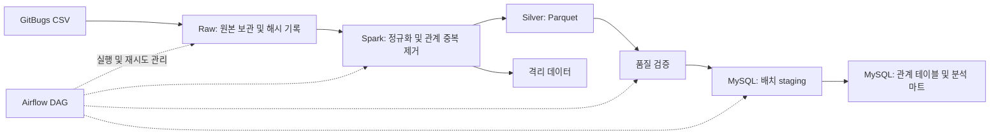

# GitBugs 데이터 파이프라인

Airflow, Apache Spark, MySQL을 사용해 이슈 간 중복 관계 데이터를 수집·정제·검증·적재하는 데이터 엔지니어링 포트폴리오 프로젝트입니다.

단순한 CSV 적재를 넘어, 한 셀에 저장된 여러 ID를 개별 관계로 정규화하고 재실행해도 결과가 중복되지 않는 배치 파이프라인을 구축하는 것을 목표로 합니다.

> **현재 상태: 구현 및 로컬 검증**  
> Spark 정규화, Parquet·격리 출력, MySQL 스냅샷 공개, Airflow DAG, Docker Compose와 자동 테스트를 제공합니다. 실행 범위와 결과는 [검증 기록](docs/validation.md)을 참고하세요.

## 1. 프로젝트 목표

- **오케스트레이션:** Airflow로 작업 의존성, 재시도, 실행 이력과 실패 복구를 관리합니다.
- **데이터 처리:** Spark로 다중 ID 분리, 형 변환, 중복 제거 및 집계를 수행합니다.
- **데이터 모델링:** MySQL에 정규화된 관계 테이블과 분석용 마트를 구성합니다.
- **품질 관리:** 입력·출력 건수, 유효하지 않은 ID, 자기 참조 관계를 검증합니다.
- **운영 안정성:** 파일 해시와 배치 식별자를 활용해 추적 가능성과 멱등성을 확보합니다.

현재 데이터는 약 19 KB로, 분산 처리가 필요한 규모는 아닙니다. Spark는 분산 데이터 처리 구조와 실행 계획을 학습하기 위해 도입했습니다. 1천·1만·10만 행 합성 데이터의 로컬 측정 결과는 [검증 기록](docs/validation.md)에 있으며, 대규모 분산 클러스터 성능과 구분합니다.

## 2. 데이터셋

분석 대상은 저장소의 [`gitbugs_full_data.csv`](./gitbugs_full_data.csv)입니다. [`data.ipynb`](./data.ipynb)에는 Hugging Face의 `av9ash/GitBugs`를 불러오는 코드가 있습니다. 현재 CSV가 어떤 split과 변환 과정으로 생성되었는지는 별도로 확인하고, 원본 라이선스와 재배포 조건도 기록할 예정입니다.

| 원본 컬럼 | 설명 | 처리 방식 |
| --- | --- | --- |
| `Issue id` | 기준 이슈 식별자 | 공백 제거 및 정수형 검증 |
| `Duplicate id` | 중복 관계로 연결된 이슈 식별자 목록 | CSV 파싱 후 셀 내부 쉼표로 분리 |

컬럼 이름만으로 어느 이슈가 원본 또는 대표 이슈인지 확정하지 않습니다. 원본 방향을 유지한 관계 테이블을 만들고, 방향을 무시한 관계는 별도 분석 모델에서 다룹니다.

### 원본 데이터 프로파일

2026-09-06 기준 저장소의 CSV를 직접 검사한 결과입니다. 정규화 관련 수치는 CSV를 파싱한 뒤 ID 목록을 분리하고 공백을 제거해 계산했습니다.

| 항목 | 값 |
| --- | ---: |
| 파일 크기 | 19,674 bytes |
| 원본 행 수 | 1,021 |
| 컬럼 수 | 2 |
| 고유 `Issue id` 수 | 1,021 |
| 빈 셀 수 | 0 |
| 완전히 동일한 원본 행 중복 수 | 0 |
| 여러 Duplicate ID가 들어 있는 행 수 | 21 |
| ID 목록 분리 후 관계 수 | 1,042 |
| 동일 방향의 중복 관계 제거 수 | 8 |
| 고유 방향 관계 수 | 1,034 |
| 정규화 후 전체 고유 이슈 수 | 1,068 |
| 방향을 무시한 고유 관계 수 | 560 |
| 분리 후 숫자가 아닌 ID 토큰 수 | 0 |
| 분리 후 자기 참조 관계 수 | 0 |

예를 들어 `13556717 → "13522998, 13522998"`은 분리하면 두 관계가 되지만, 최종 방향 관계 테이블에는 한 번만 저장해야 합니다. `A → B`와 `B → A`는 방향 관계 테이블에서는 유지하고, 무방향 분석에서만 하나로 합칩니다.

현재 CSV에는 제목, 본문, 저장소 이름, 생성·종료 시각, 상태가 없습니다. 따라서 해결 시간, 저장소별 생산성, 시계열 추세, 텍스트 기반 중복 탐지는 현재 데이터만으로 분석할 수 없습니다.

## 3. 시스템 아키텍처



| 구성 요소 | 역할 |
| --- | --- |
| Airflow | 배치 실행, 의존성 관리, 재시도 및 실행 상태 추적 |
| Spark / PySpark | CSV 파싱, `split`·`explode` 기반 정규화, 검증용 통계와 마트 집계 |
| MySQL | 배치 이력, 관계 데이터 및 SQL 조회용 마트 저장 |
| Parquet | 정제 결과 보관 및 재처리 입력 |
| Docker Compose | 로컬 실행 환경 구성 및 재현성 확보 |

Airflow는 작업을 조율하고 실제 데이터 변환은 Spark가 수행하도록 분리합니다. 작업 간에는 데이터 전체 대신 배치 ID, 파일 경로, 검증 결과 같은 작은 메타데이터만 전달합니다.

## 4. 배치 처리 흐름

DAG ID는 `gitbugs_batch_pipeline`입니다. 현재 입력은 정적 CSV이므로 우선 수동 실행을 지원하고, 주기적인 파일 공급원이 생기면 스케줄을 추가합니다.

```text
inspect_source → register_batch → archive_raw → normalize_with_spark
    → validate_silver → load_staging → publish_snapshot → verify_publish
```

1. **입력 검사 및 배치 등록**
   - 파일 존재 여부, 헤더, 인코딩 및 CSV 파싱 가능 여부를 확인합니다.
   - 파일의 SHA-256과 변환 버전을 기록하고 처리할 데이터 버전을 식별합니다.
2. **원본 보관**
   - 배치별 원본 파일을 보존하고 원본 파일명, 입력 건수, 수집 시각을 기록합니다.
3. **Spark 정규화**
   - 원본 컬럼을 `issue_id`, `duplicate_id`로 매핑합니다.
   - 따옴표로 감싼 CSV 필드를 올바르게 읽은 뒤 `Duplicate id`의 목록을 분리합니다.
   - 공백 제거, 양의 정수 및 BIGINT 범위 검증 후 형을 변환합니다.
   - 잘못된 레코드를 사유와 함께 격리하고 `(issue_id, duplicate_id)` 중복을 제거합니다.
4. **품질 검증 및 중간 결과 저장**
   - 정제 결과는 Parquet으로 저장합니다.
   - 입력, 분리, 격리, 중복 제거, 최종 출력 건수가 서로 일치하는지 확인합니다.
5. **MySQL 적재 및 공개**
   - 배치별 staging에 관계 데이터와 집계 결과를 적재합니다.
   - 적재 검증을 통과한 배치만 트랜잭션으로 공개 상태로 전환합니다.
6. **사후 검증**
   - 공개된 관계 건수 및 마트 집계값을 확인하고 배치 상태를 완료로 기록합니다.

## 5. MySQL 데이터 모델

입력을 전체 스냅샷으로 취급하고, 배치별 결과를 보존합니다. 최신 성공 배치를 가리키는 포인터를 통해 조회하면 파일에서 삭제된 관계가 이전 적재 결과에 남는 문제를 방지할 수 있습니다.

| 테이블 | 주요 컬럼 | 키 및 용도 |
| --- | --- | --- |
| `pipeline_batch` | `batch_id`, `source_sha256`, `transform_version`, `status`, `started_at`, `finished_at`, `input_rows`, `output_rows` | 배치 PK, 해시·변환 버전 조합 UNIQUE |
| `stg_issue_relation` | `batch_id`, `issue_id`, `duplicate_id` | 세 컬럼 복합 PK, 검증 전 배치 데이터 |
| `issue_relation` | `batch_id`, `issue_id`, `duplicate_id` | 세 컬럼 복합 PK, 정규화된 방향 관계 |
| `mart_issue_degree` | `batch_id`, `issue_id`, `in_degree`, `out_degree`, `neighbor_count` | 배치·이슈 복합 PK, 이슈별 연결 통계 |
| `mart_relation_summary` | `batch_id`, `issue_count`, `directed_relation_count`, `undirected_relation_count` | 배치 PK, 전체 요약 지표 |
| `pipeline_current` | `dataset_name`, `batch_id` | 데이터셋 PK, 현재 공개된 성공 배치 |

ID 컬럼에는 `BIGINT`를 사용하고, 역방향 조회를 위해 `issue_relation(batch_id, duplicate_id)` 인덱스를 제공합니다. `neighbor_count`는 방향을 무시한 고유 이웃 수이며, 양방향 연결이 있을 수 있으므로 `in_degree + out_degree`와 구분합니다.

### 멱등성 및 장애 복구

- 동일한 파일 해시와 변환 버전이 이미 성공한 경우 재적재를 건너뜁니다.
- 실패한 배치는 같은 배치 ID로 재개하고, 해당 배치 staging을 초기화한 뒤 재적재합니다.
- Spark 결과의 MySQL 청크 적재 도중 실패해 일부 데이터가 저장되어도 공개 중인 배치는 유지합니다.
- 검증된 staging 결과를 최종 테이블에 반영하고 공개 배치 포인터를 변경하는 작업은 MySQL 트랜잭션으로 묶습니다.
- 일시적 연결 오류는 재시도하고, 스키마 불일치나 품질 실패는 원인을 수정한 뒤 재실행합니다.

## 6. 데이터 품질 기준

| 검증 | 기준 및 처리 |
| --- | --- |
| 스키마 | 필수 컬럼 누락 시 배치 실패 |
| CSV 파싱 | 손상된 레코드를 기록하고 기본적으로 공개 중단 |
| ID 유효성 | 빈 값, 비정수, 0 이하, BIGINT 범위 초과는 격리 |
| 자기 참조 | `issue_id = duplicate_id` 관계는 격리 |
| 중복 관계 | 같은 방향의 동일 관계는 한 건만 유지 |
| 건수 정합성 | 분리 후 관계 수 = 격리 관계 수 + 중복 제거 수 + 최종 관계 수 |
| 적재 정합성 | 배치별 MySQL 관계 수와 Silver 결과 수 일치 |
| 공개 정책 | 초기에는 격리 건수가 0일 때만 공개 |

현재 CSV의 회귀 검증 기대값은 **1,042개 분리 관계 → 중복 8개 제거 → 1,034개 방향 관계**입니다. 이 고정 건수는 현재 파일을 검증하는 데만 사용하고, 향후 입력 데이터에는 일반 품질 규칙을 적용합니다.

## 7. 분석 결과물

- 전체 이슈 수 및 방향·무방향 관계 수
- 이슈별 들어오는 관계 수, 나가는 관계 수 및 고유 이웃 수
- 상호 참조 관계 비율 및 연결 수 상위 이슈
- 선택 확장: 무방향 그래프의 연결 요소와 그룹 크기 분포

연결 요소는 관계상 연결된 집합입니다. 원본 관계의 의미를 추가 검증하기 전에는 같은 실제 버그를 나타내는 정답 그룹으로 간주하지 않습니다.

현재 공개된 배치를 조회하는 SQL입니다.

```sql
SELECT d.issue_id, d.in_degree, d.out_degree, d.neighbor_count
FROM mart_issue_degree AS d
JOIN pipeline_current AS c ON c.batch_id = d.batch_id
WHERE c.dataset_name = 'gitbugs'
ORDER BY d.neighbor_count DESC, d.issue_id
LIMIT 10;
```

## 8. 저장소 구성

```text
.
├── README.md
├── gitbugs_full_data.csv          # 현재 입력 데이터
├── data.ipynb                     # 현재 데이터 탐색 노트북
├── dags/                         # Airflow DAG
├── spark/jobs/                   # 정규화 및 집계 작업
├── sql/                          # DDL, 공개 처리 및 분석 쿼리
├── tests/                        # 변환·품질·재실행 검증
├── data/                         # raw, silver, quarantine 결과
├── docs/                         # 실행 증거, 설계 결정, 성능 실험
├── docker-compose.yml            # 로컬 서비스 구성
├── requirements.txt              # Python 의존성
└── .env.example                  # 환경 변수 예시
```

공통 로직은 `pipeline/`, CLI 진입점은 `python -m pipeline`에 있습니다. 비밀번호와 연결 정보는 환경 변수로 관리하며 실제 `.env`와 생성 데이터는 Git 추적에서 제외합니다. `stg_issue_degree`에 마트도 먼저 적재하고, 관계·마트·현재 포인터·SUCCESS 상태를 한 트랜잭션에서 공개합니다.

## 9. 구현 로드맵 및 검증

- [x] 원본 컬럼 및 데이터 프로파일 확인
- [x] 정규화 규칙과 시스템 설계 문서화
- [x] Docker Compose 환경 구성 및 호환되는 버전 고정
- [x] Spark 정규화 작업과 Parquet 출력 구현
- [x] MySQL 스키마, staging 및 배치 공개 로직 구현
- [x] Airflow DAG, 재시도 및 실패 기록 구현
- [x] SQL 분석 마트 및 조회 결과 작성
- [x] 같은 입력을 두 번 실행해 최종 건수가 유지되는지 검증
- [x] 적재 중 실패를 주입하고 재실행 후 결과 일관성 검증
- [x] 잘못된 ID, 다중 ID, 반복 ID, 자기 참조를 포함한 작은 테스트 데이터로 품질 규칙 검증
- [x] 실제 실행 명령, 환경 사양, 처리 시간 및 DAG 작업 상태 기록 추가
- [ ] Airflow UI 화면 캡처 추가 (현재 세션에 연결 가능한 브라우저 없음)

### 실행 방법

Docker Desktop의 Linux 컨테이너와 Compose v2를 사용합니다. 메모리는 8 GB 이상을 권장합니다. 컨테이너는 Airflow 2.10.5 / Python 3.11 / Java 17 / PySpark 3.5.6 / MySQL 8.4.4 / PostgreSQL 16.8로 구성했습니다. PostgreSQL은 Airflow 메타데이터만 저장합니다. 이 구성은 로컬 학습용입니다.

PowerShell에서 다음을 실행합니다. `.env`가 이미 있으면 복사 단계를 건너뜁니다.

```powershell
Copy-Item .env.example .env
docker compose build airflow-init
docker compose up -d airflow-webserver airflow-scheduler
docker compose exec airflow-scheduler airflow dags unpause gitbugs_batch_pipeline
docker compose exec airflow-scheduler airflow dags trigger gitbugs_batch_pipeline
```

초기화 서비스가 DB 마이그레이션, 관리자 계정 생성 및 분석 스키마 생성을 수행합니다. UI는 <http://localhost:8080>이며 `.env`의 관리자 계정으로 로그인합니다. 기본 예시 계정은 `admin` / `local-airflow-password`입니다. DAG Grid에서 8개 작업 상태와 로그를 확인할 수 있습니다. 코드 변경 후에는 이미지를 다시 빌드하고 `docker compose up -d`로 반영합니다.

Airflow 스케줄러 없이 같은 파이프라인을 실행할 수도 있습니다.

```powershell
docker compose run --rm airflow-init
docker compose run --rm --no-deps --entrypoint python airflow-init -m pipeline run
docker compose run --rm --no-deps --entrypoint python airflow-init -m pipeline run
```

두 번째 실행은 `skipped: true`를 반환합니다. 원본 검사는 외부 패키지 없이 `python -m pipeline profile --output docs/source-profile.json`으로 실행할 수 있습니다.

분석 SQL은 아래 명령으로 실행합니다.

```powershell
Get-Content sql/analysis.sql | docker compose exec -T mysql sh -c 'MYSQL_PWD="$MYSQL_PASSWORD" mysql -u gitbugs gitbugs'
```

산출물은 `data/batches/<batch_id>/raw/`의 원본·manifest와 `attempts/<owner_token>/`의 `silver/relations`, `silver/degrees`, `quarantine`, `quality.json`, `spark-plan.txt`에 남습니다. 손상된 CSV는 초기 검사에서 행 번호와 함께 오류를 출력하고, 유효하지 않은 ID는 격리한 뒤 공개를 중단합니다.

### 테스트 및 장애 복구

```powershell
python -m pytest -q
docker compose run --rm --no-deps --entrypoint python airflow-init -m pytest -q -m 'not mysql'
```

MySQL 테스트는 이름이 `_test`로 끝나는 별도 DB에서만 실행됩니다. `.env.example`의 로컬 비밀번호를 사용하는 경우 다음과 같이 준비합니다. 비밀번호를 바꿨다면 실제 루트 비밀번호를 환경으로 주입하세요.

```powershell
docker compose run --rm --no-deps --entrypoint python -e MYSQL_USER=root -e MYSQL_PASSWORD=local-root-password airflow-init scripts/create_test_database.py
docker compose run --rm --no-deps --entrypoint python -e MYSQL_DATABASE=gitbugs_test airflow-init -m pytest -q --junitxml=data/test-results.xml
```

통합 테스트는 staging 청크 커밋 직후와 공개 커밋 직전의 실패를 주입해 이전 공개 배치 유지, 같은 배치 ID 재개, 중복 실행, 삭제된 관계 제외 및 오래된 작업자의 쓰기 차단을 확인합니다. CLI로도 새 변환 버전을 주어 재현할 수 있습니다.

```powershell
docker compose run --rm --no-deps --entrypoint python airflow-init -m pipeline run --version recovery-demo --failpoint after_staging_chunk
docker compose run --rm --no-deps --entrypoint python airflow-init -m pipeline run --version recovery-demo
```

Airflow는 일시적 오류를 30초 간격으로 두 번 재시도합니다. 품질 오류는 즉시 실패 처리하고, 마지막 실패 콜백은 배치를 FAILED로 기록합니다. 강제 종료로 RUNNING이 남으면 **해당 작업자가 종료됐는지 확인한 뒤** `python -m pipeline recover <batch_id>`를 컨테이너에서 실행하고 새 DAG run을 시작합니다. 실패한 하위 작업만 지우면 FAILED 배치의 소유권 검사를 통과하지 못하므로 새 run으로 배치 등록부터 재개합니다.

합성 데이터 실험은 `docker compose run --rm --no-deps --entrypoint python airflow-init scripts/benchmark.py --rows 1000 10000 100000`으로 실행합니다. 결과는 `data/benchmark/benchmark.json`이며, JVM 시작 비용과 변환 시간을 분리합니다. Spark는 `local[2]`, shuffle 파티션 4개를 기본으로 사용하고, MySQL은 드라이버에서 최대 500개씩 삽입합니다. 현재 소규모 입력을 위한 설정이며 대규모 JDBC 병렬 적재 성능을 주장하지 않습니다.

서비스 종료는 `docker compose down`으로 수행합니다. DB 볼륨은 보존됩니다.

## 10. 포트폴리오에서 제시할 근거

| 역량 | 제출할 근거 |
| --- | --- |
| 데이터 이해 | 원본 프로파일, 다중 ID 처리 전후 예시, 분석 한계 |
| Spark 처리 | 정규화 코드, 실행 계획, 파티션 설정 근거 |
| Airflow 운영 | DAG 실행 화면, 실패·재시도 로그, 복구 시나리오 |
| MySQL 모델링 | DDL, 인덱스, 분석 SQL 및 조회 실행 계획 |
| 신뢰성 | 품질 보고서, 중복 실행 및 부분 실패 복구 결과 |
| 성능 분석 | 입력 크기별 처리 시간, 처리량, 메모리와 실행 환경 |

성능 실험에는 규모별 합성 데이터를 사용하고 실제 원본 데이터와 결과를 구분합니다. 측정 전 성능 개선 수치를 제시하지 않으며, 작은 데이터에서 Spark 시작 비용이 차지하는 영향도 함께 기록합니다.
